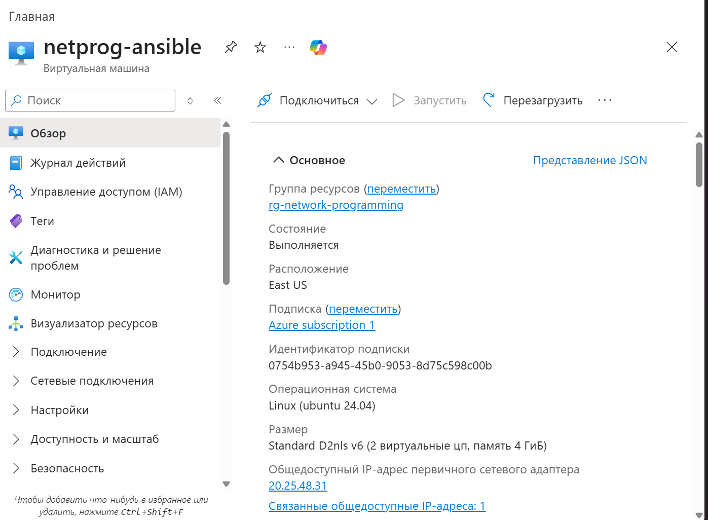
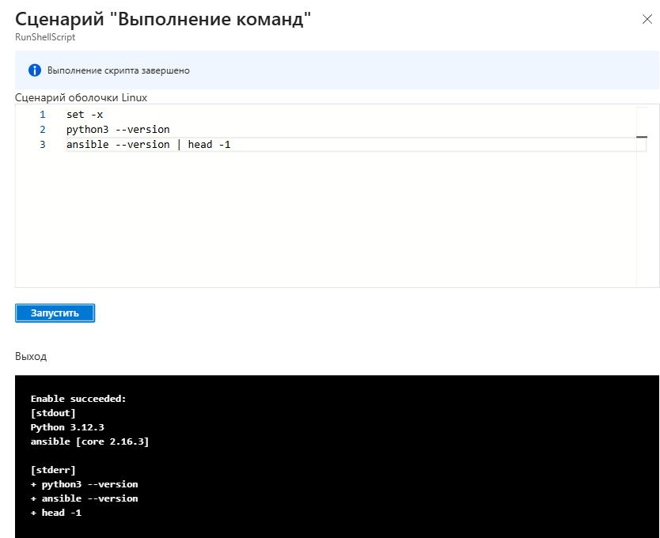
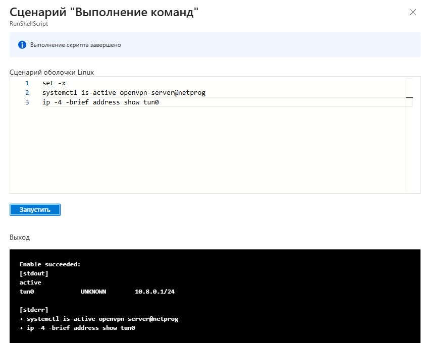
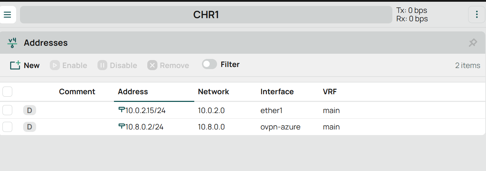
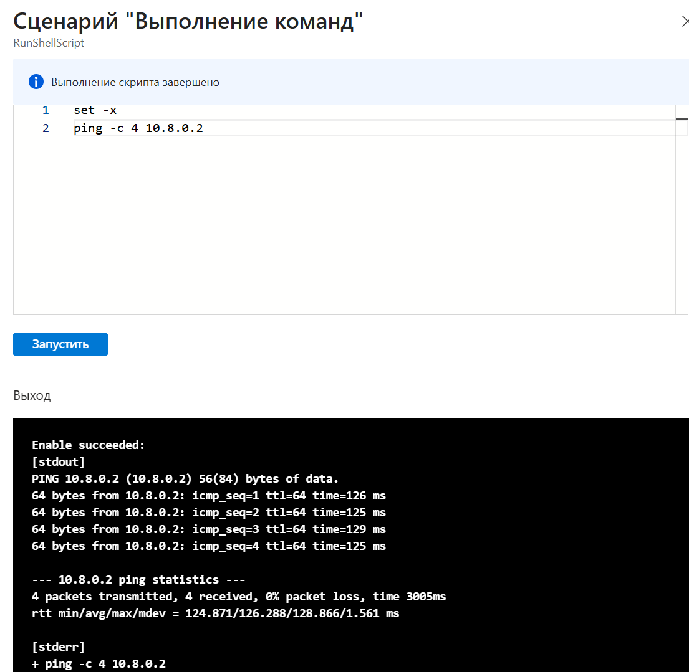
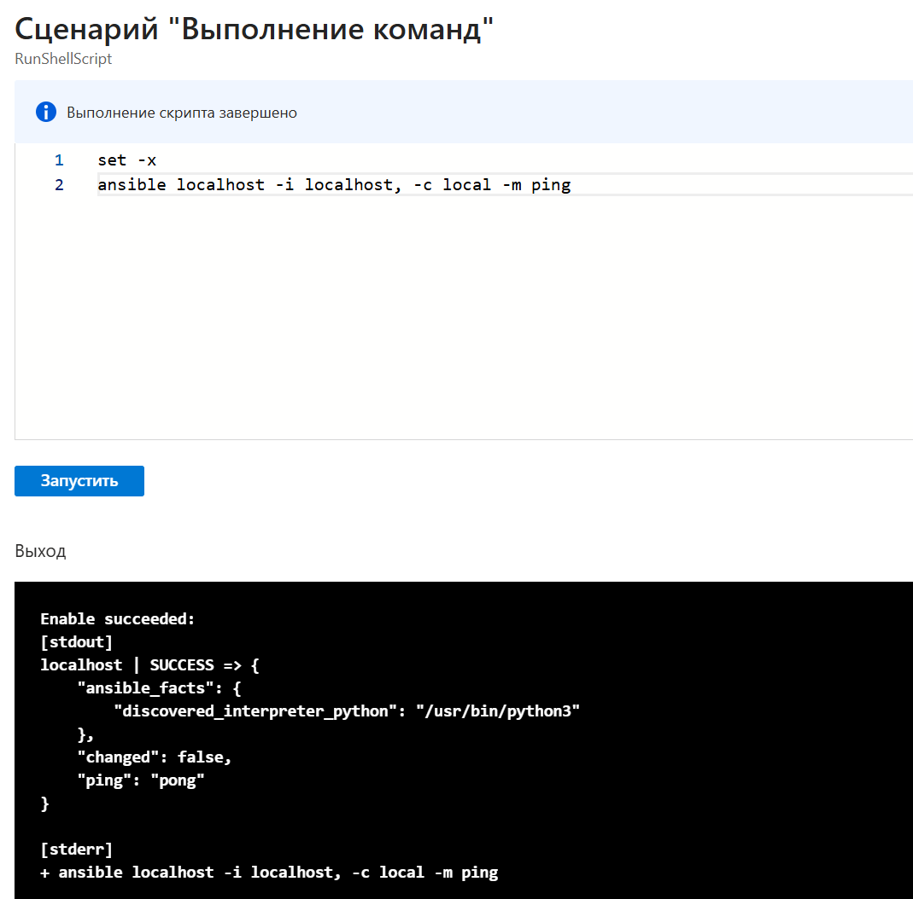

University: [ITMO University](https://itmo.ru/ru/)  
Faculty: [FICT](https://fict.itmo.ru)  
Course: [Network programming](https://github.com/itmo-ict-faculty/network-programming)  
Year: 2025/2026  
Group: К3421  
Author: Царёв Александр Сергеевич  
Lab: Lab1  
Date of create: 29.09.2026  
Date of finished: 

# Лабораторная работа №1
# Установка CHR и Ansible, настройка VPN

## Цель работы

Установить MikroTik CHR и Ansible, настроить VPN между маршрутизатором и облачным сервером и проверить передачу пакетов через туннель.

## Ход работы

### 1. Установка MikroTik CHR

Загружен образ MikroTik CHR и создана виртуальная машина `NetProg-CHR1` в VirtualBox. Для неё выделены один процессор и 1024 МБ оперативной памяти, подключён загруженный виртуальный диск. Сетевой адаптер настроен в режиме NAT для доступа маршрутизатора в интернет через компьютер.

После запуска виртуальной машины открыта консоль RouterOS.


Рисунок 1 — Консоль MikroTik CHR.

Команды RouterOS выполнялись на локальной виртуальной машине через терминал WebFig в браузере по адресу `http://127.0.0.1:8081/`.

Маршрутизатору задано имя `CHR1`:

```routeros
/system identity set name=CHR1
```

Выполнена проверка доступа в интернет:

```routeros
/ping 1.1.1.1 count=4
```

Получены четыре ответа без потерь.


Рисунок 2 — Проверка доступа CHR в интернет.

### 2. Создание сервера в Azure и установка Ansible

В Azure создана виртуальная машина `netprog-ansible` с Ubuntu 24.04. Сервер получил публичный IP-адрес `20.25.48.31`. В сетевых правилах разрешены подключения к SSH по TCP-порту 22 и к OpenVPN по TCP-порту 1194 с внешнего адреса локального компьютера.



Рисунок 3 — Виртуальная машина Ubuntu в Azure.

При создании сервера передана конфигурация cloud-init для автоматической установки программ. В ней указаны следующие пакеты:

```yaml
packages:
  - python3
  - python3-pip
  - python3-venv
  - ansible
  - openvpn
  - easy-rsa
  - openssl
```

После установки проверены версии программ на сервере:

```bash
python3 --version
ansible --version | head -1
```

Установлены Python 3.12.3 и Ansible Core 2.16.3.



Рисунок 4 — Проверка версий Python и Ansible.

### 3. Настройка сервера OpenVPN

Для настройки OpenVPN использован сценарий `setup-openvpn.sh`. Сценарий создаёт центр сертификации, выпускает сертификаты сервера и клиента CHR1 и записывает конфигурацию VPN.

В конфигурации заданы TCP-порт 1194 и сеть туннеля `10.8.0.0/24`. Основные параметры файла `/etc/openvpn/server/netprog.conf`:

```conf
port 1194
proto tcp-server
dev tun
topology subnet
server 10.8.0.0 255.255.255.0
ca /etc/openvpn/netprog-pki/ca.crt
cert /etc/openvpn/netprog-pki/server.crt
key /etc/openvpn/netprog-pki/server.key
cipher AES-256-CBC
auth SHA256
client-config-dir /etc/openvpn/server/ccd
```

За клиентом CHR1 закреплён адрес `10.8.0.2`. Для этого в файл `/etc/openvpn/server/ccd/chr1` добавлена строка:

```conf
ifconfig-push 10.8.0.2 255.255.255.0
```

В сценарии выполнен запуск службы командой:

```bash
systemctl enable --now openvpn-server@netprog
```

Проверены состояние службы и адрес интерфейса:

```bash
systemctl is-active openvpn-server@netprog
ip -4 -brief address show tun0
```

Служба активна, адрес интерфейса `tun0`: `10.8.0.1/24`.



Рисунок 5 — Проверка службы OpenVPN и адреса tun0.

### 4. Подключение CHR к VPN

На маршрутизатор переданы сертификат центра сертификации, клиентский сертификат и ключ. После импорта сертификатов создан интерфейс `ovpn-azure`. В его настройках указаны адрес сервера `20.25.48.31`, порт `1194`, протокол TCP, клиентский сертификат, шифрование AES-256-CBC и алгоритм SHA256. Включена проверка сертификата сервера.

Подключение проверено командой:

```routeros
/interface ovpn-client monitor ovpn-azure once
```

Клиент подключён, получен адрес `10.8.0.2`.


Рисунок 6 — Проверка подключения VPN-клиента.

Затем проверены адреса интерфейсов:

```routeros
/ip address print
```

У маршрутизатора появился адрес `10.8.0.2/24` на интерфейсе `ovpn-azure`.



Рисунок 7 — IP-адреса интерфейсов CHR.

### 5. Проверка связи через VPN

#### 5.1. Проверка с сервера Ubuntu до CHR

С сервера Ubuntu отправлены четыре пакета на адрес CHR внутри туннеля:

```bash
ping -c 4 10.8.0.2
```

Получены четыре ответа без потерь.



Рисунок 8 — Проверка связи с Ubuntu до CHR.

#### 5.2. Проверка с CHR до сервера Ubuntu

Затем выполнена проверка связи в обратном направлении, с CHR до сервера:

```routeros
/ping 10.8.0.1 count=4
```

Получены четыре ответа без потерь.


Рисунок 9 — Проверка связи с CHR до Ubuntu.

### 6. Проверка Ansible

На сервере Ubuntu выполнена локальная проверка Ansible:

```bash
ansible localhost -i localhost, -c local -m ping
```

Получен ответ `SUCCESS` с результатом `pong`.



Рисунок 10 — Проверка Ansible.

## Вывод

Установлен MikroTik CHR в VirtualBox и подготовлен сервер Ubuntu с Ansible в Azure. Настроен OpenVPN между сервером и маршрутизатором. Проверки ping в обоих направлениях прошли без потерь, локальная проверка Ansible завершилась успешно.


