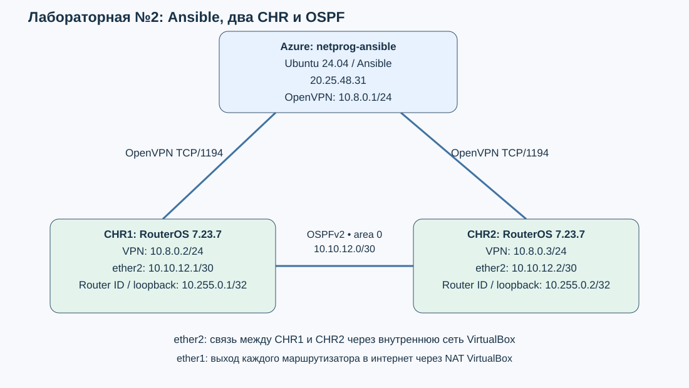
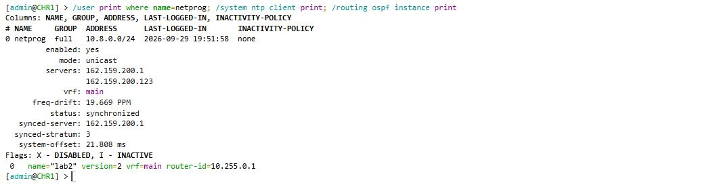
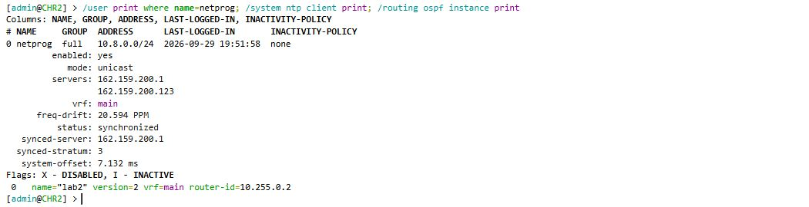
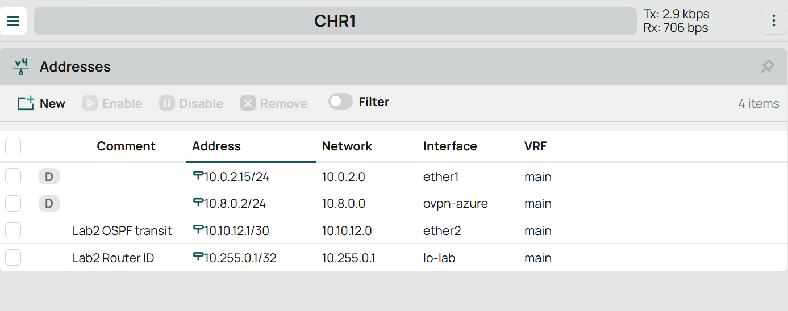
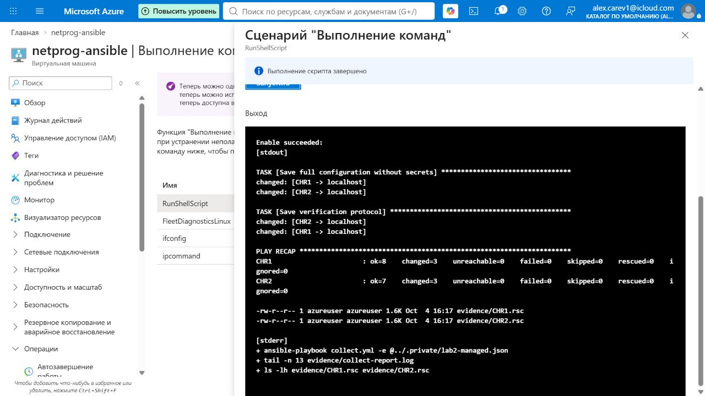
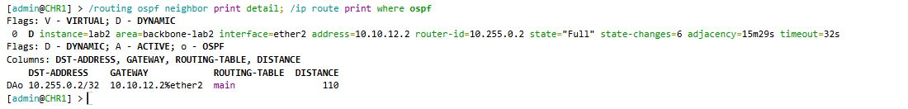
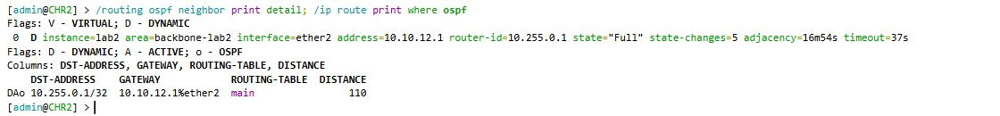

University: [ITMO University](https://itmo.ru/ru/)  
Faculty: [FICT](https://fict.itmo.ru)  
Course: [Network programming](https://github.com/itmo-ict-faculty/network-programming)  
Year: 2025/2026  
Group: К3421  
Author: Царёв Александр Сергеевич  
Lab: Lab2  
Date of create: 29.09.2026  
Date of finished: 

# Лабораторная работа №2
# Развёртывание дополнительного CHR, первый сценарий Ansible

## Цель работы

Установить второй MikroTik CHR, составить inventory и с помощью Ansible настроить два маршрутизатора. Собрать сведения о топологии OSPF и конфигурации устройств, проверить связь между ними.

## Ход работы

### 1. Установка второго MikroTik CHR

На локальном компьютере в VirtualBox создана виртуальная машина `NetProg-CHR2`. Подключён диск с образом MikroTik CHR, выделены один процессор и 1024 МБ оперативной памяти. Маршрутизатору задано имя:

```routeros
/system identity set name=CHR2
```

Первый сетевой адаптер настроен в режиме NAT для доступа в интернет. Вторые адаптеры CHR1 и CHR2 подключены к внутренней сети VirtualBox `netprog-ospf` для обмена маршрутами OSPF. Для управления используется сервер Ubuntu с Ansible из первой лабораторной работы.

Подготовлена схема соединений. Исходный файл схемы: [topology.drawio](topology.drawio).



Рисунок 1 — Схема сети.

### 2. Подключение CHR2 к OpenVPN

На сервере Ubuntu выпущен клиентский сертификат `chr2`. За вторым маршрутизатором закреплён адрес `10.8.0.3`. В файл `/etc/openvpn/server/ccd/chr2` добавлена строка:

```conf
ifconfig-push 10.8.0.3 255.255.255.0
```

На CHR2 переданы и импортированы сертификат центра сертификации, клиентский сертификат и ключ. Создан интерфейс `ovpn-azure` для подключения к `20.25.48.31:1194` по TCP. Заданы AES-256-CBC и SHA256, включена проверка сертификата сервера.

В терминале WebFig второго маршрутизатора по адресу `http://127.0.0.1:8082/` выполнена команда:

```routeros
/interface ovpn-client monitor ovpn-azure once
```

Получены состояние `connected` и адрес `10.8.0.3`.


Рисунок 2 — Подключение CHR2 к OpenVPN.

### 3. Подготовка inventory

На сервере Ubuntu в каталоге `/home/azureuser/netprog-lab/lab2` подготовлен файл `inventory.yml`. В группу `routers` включены оба устройства с адресами VPN. Для каждого указаны Router ID, транзитный адрес и адреса соседа:

```yaml
all:
  children:
    routers:
      vars:
        ansible_connection: ansible.netcommon.network_cli
        ansible_network_os: community.routeros.routeros
        ansible_network_cli_ssh_type: paramiko
        ansible_user: "{{ lab_login | default('admin') }}+cet1024w"
        ansible_password: "{{ lab_passwords[inventory_hostname] }}"
      hosts:
        CHR1:
          ansible_host: 10.8.0.2
          router_id: 10.255.0.1
          transit_address: 10.10.12.1/30
          peer_address: 10.10.12.2
          peer_router_id: 10.255.0.2
        CHR2:
          ansible_host: 10.8.0.3
          router_id: 10.255.0.2
          transit_address: 10.10.12.2/30
          peer_address: 10.10.12.1
          peer_router_id: 10.255.0.1
```

Параметры `+cet1024w` задают режим консоли RouterOS для автоматизации. Пароли вынесены в отдельный файл переменных.

### 4. Настройка маршрутизаторов через Ansible

Подготовлен сценарий `configure.yml` для группы `routers`. Через модуль `community.routeros.command` в него включены задачи:

1. Создание пользователя `netprog` с отдельным паролем на каждом маршрутизаторе.
2. Включение NTP-клиента и добавление серверов `162.159.200.1` и `162.159.200.123`.
3. Назначение адресов `10.10.12.1/30` и `10.10.12.2/30` интерфейсам `ether2`, создание интерфейсов `lo-lab` с адресами `10.255.0.1/32` и `10.255.0.2/32`.
4. Настройка OSPFv2 в области `0.0.0.0` с Router ID `10.255.0.1` и `10.255.0.2`.

Для настройки NTP в сценарии выполняется команда:

```routeros
/system ntp client set enabled=yes mode=unicast
```

Серверы времени добавляются командами `/system ntp client servers add`. Перед добавлением проверяется наличие записи, чтобы при повторном запуске не создавать дубликаты.

Для OSPF создан экземпляр `lab2` и область `backbone-lab2`. На `ether2` задан тип соединения point-to-point, а сеть интерфейса `lo-lab` объявлена пассивно. Полный сценарий сохранён в файле [configure.yml](additional/configure.yml).

На сервере Ubuntu выполнен запуск:

```bash
cd /home/azureuser/netprog-lab/lab2
ansible-playbook configure.yml -e @../.private/lab2-secrets.json
```

Настройки применены к обоим маршрутизаторам. Затем на каждом проверены пользователь, синхронизация времени и Router ID:

```routeros
/user print where name=netprog
/system ntp client print
/routing ospf instance print
```

На CHR1 присутствует пользователь `netprog`, NTP-клиент синхронизирован, Router ID равен `10.255.0.1`.



Рисунок 3 — Проверка настроек CHR1.

На CHR2 также создан пользователь `netprog`, NTP-клиент синхронизирован, Router ID равен `10.255.0.2`.



Рисунок 4 — Проверка настроек CHR2.

Назначенные адреса проверены в разделе IP → Addresses интерфейса WebFig.



Рисунок 5 — IP-адреса CHR1.

### 5. Сбор данных и конфигураций

Подготовлен сценарий `collect.yml`. Подключение выполняется под созданным пользователем `netprog`. Модуль `community.routeros.facts` собирает сведения об устройствах, а `community.routeros.command` получает соседей OSPF, LSA, маршруты и полный текст конфигурации.

В сценарии используются команды:

```routeros
/routing ospf neighbor print detail without-paging
/routing ospf lsa print detail without-paging
/ip route print detail without-paging where ospf
/export terse
```

На сервере Ubuntu выполнен запуск:

```bash
ansible-playbook collect.yml -e @../.private/lab2-managed.json
```

Сбор данных завершился для обоих устройств с `failed=0` и `unreachable=0`. Конфигурации сохранены в файлы `CHR1.rsc` и `CHR2.rsc`.



Рисунок 6 — Сбор конфигураций CHR1 и CHR2.

Полученные файлы: [CHR1.rsc](CHR1.rsc) и [CHR2.rsc](CHR2.rsc). Сведения о топологии OSPF сохранены в протоколах [CHR1](additional/evidence/CHR1-verification.txt) и [CHR2](additional/evidence/CHR2-verification.txt).

### 6. Проверка OSPF и связи между маршрутизаторами

#### 6.1. Проверка соседства и маршрутов

На обоих маршрутизаторах выполнены команды:

```routeros
/routing ospf neighbor print detail
/ip route print where ospf
```

На CHR1 сосед `10.10.12.2` находится в состоянии `Full`. Получен маршрут к `10.255.0.2/32` через `10.10.12.2`.



Рисунок 7 — Соседство OSPF и маршрут на CHR1.

На CHR2 сосед `10.10.12.1` находится в состоянии `Full`. Получен обратный маршрут к `10.255.0.1/32` через `10.10.12.1`.



Рисунок 8 — Соседство OSPF и маршрут на CHR2.

#### 6.2. Проверка связи с CHR1 до CHR2

С CHR1 отправлены четыре пакета на loopback-адрес CHR2. В качестве исходного адреса указан loopback CHR1:

```routeros
/ping 10.255.0.2 src-address=10.255.0.1 count=4
```

Получены четыре ответа без потерь.


Рисунок 9 — Проверка связи с CHR1 до CHR2.

#### 6.3. Проверка связи с CHR2 до CHR1

Выполнена проверка в обратном направлении:

```routeros
/ping 10.255.0.1 src-address=10.255.0.2 count=4
```

Получены четыре ответа без потерь. Доступность loopback-адресов подтверждает передачу пакетов по маршрутам OSPF.


Рисунок 10 — Проверка связи с CHR2 до CHR1.

## Вывод

Установлен второй MikroTik CHR и подключён к OpenVPN. С помощью Ansible на двух маршрутизаторах настроены учётные записи, NTP и OSPF. Собраны сведения о топологии и сохранены два файла конфигураций. Соседство OSPF установлено, проверка связи между маршрутизаторами в обоих направлениях прошла без потерь.
