University: [ITMO University](https://itmo.ru/ru/)  
Faculty: [FICT](https://fict.itmo.ru)  
Course: [Network programming](https://github.com/itmo-ict-faculty/network-programming)  
Year: 2025/2026  
Group: К3421  
Author: Царёв Александр Сергеевич  
Lab: Lab3  
Date of create: 29.09.2026  
Date of finished: 

# Лабораторная работа №3
# Развёртывание NetBox и настройка CHR по данным технического учёта

## Цель работы

Развернуть NetBox на отдельной виртуальной машине, внести сведения о маршрутизаторах и выгрузить их с помощью Ansible. Настроить два CHR по данным NetBox, собрать идентификаторы устройств и записать их в систему учёта.

## Ход работы

### 1. Подготовка виртуальной машины и установка NetBox

На локальном компьютере в VirtualBox создана виртуальная машина `NetProg-NetBox` с Ubuntu 24.04. Выделены один процессор, 6 ГБ оперативной памяти и диск объёмом 30 ГБ. Первый сетевой адаптер обеспечивает выход в интернет через NAT. Второй подключён к внутренней сети `netprog-ospf`, в которой находятся CHR1 и CHR2. На Ubuntu задан адрес `172.20.30.10/24`.

Подготовлена схема соединений:

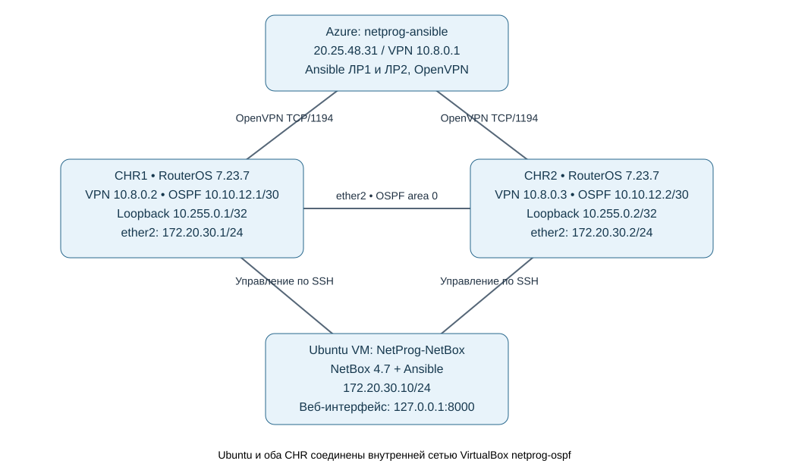

Рисунок 1 — Схема сети с сервером NetBox.

Для установки использован проект `netbox-community/netbox-docker`. В сценарии установки выполнены команды:

```bash
cd /home/labuser
git clone --depth 1 --branch release https://github.com/netbox-community/netbox-docker.git
cd netbox-docker
sudo docker compose pull
sudo docker compose up -d
```

Перед запуском в конфигурации Docker задан проброс порта `8000:8080`. После запуска открыт веб-интерфейс NetBox по адресу `http://127.0.0.1:8000/`.

Все последующие команды Ansible выполнялись на этой локальной Ubuntu VM. Команды RouterOS выполнялись на CHR1 и CHR2 через терминалы WebFig.

### 2. Заполнение сведений об устройствах

В NetBox созданы площадка `ITMO K3421 Lab`, производитель `MikroTik`, тип устройства `Cloud Hosted Router`, роль `Lab router` и платформа `RouterOS 7.23.7`. Для маршрутизаторов созданы карточки с именами `CHR1` и `CHR2`.

Заполнены сведения об интерфейсах, MAC-адресах, IP-адресах и подсетях. Основными адресами устройств указаны `10.8.0.2` и `10.8.0.3`. В дополнительных полях сохранены сведения Ansible из второй лабораторной: версия RouterOS, память, интерфейсы и маршруты.

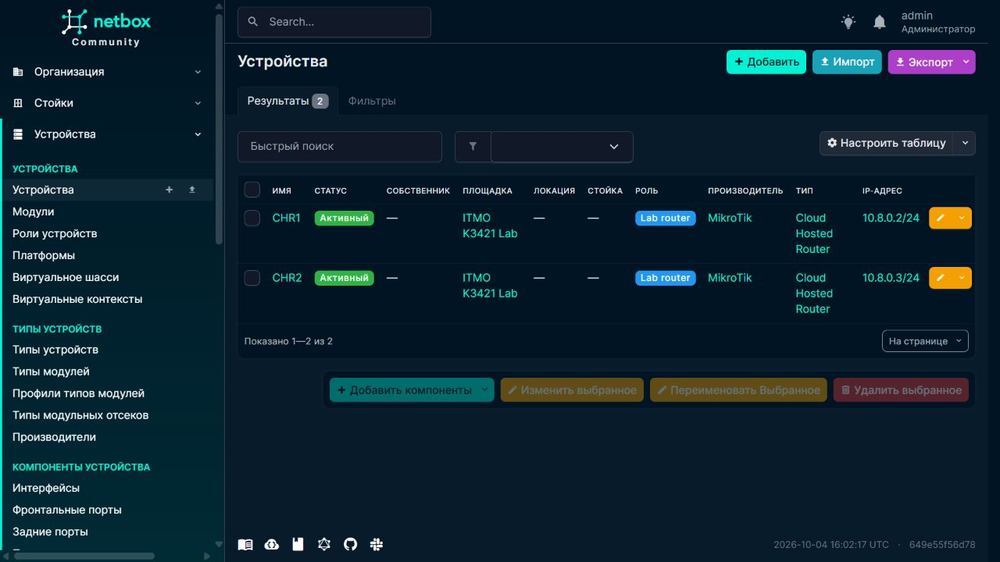

Рисунок 2 — Карточки CHR1 и CHR2 в NetBox.

Для последующей настройки на интерфейсах `ether2` указаны адреса `172.20.30.1/24` для CHR1 и `172.20.30.2/24` для CHR2. Эти записи отмечены описанием `Lab3 managed`, по которому сценарий Ansible выбирает адреса для применения.

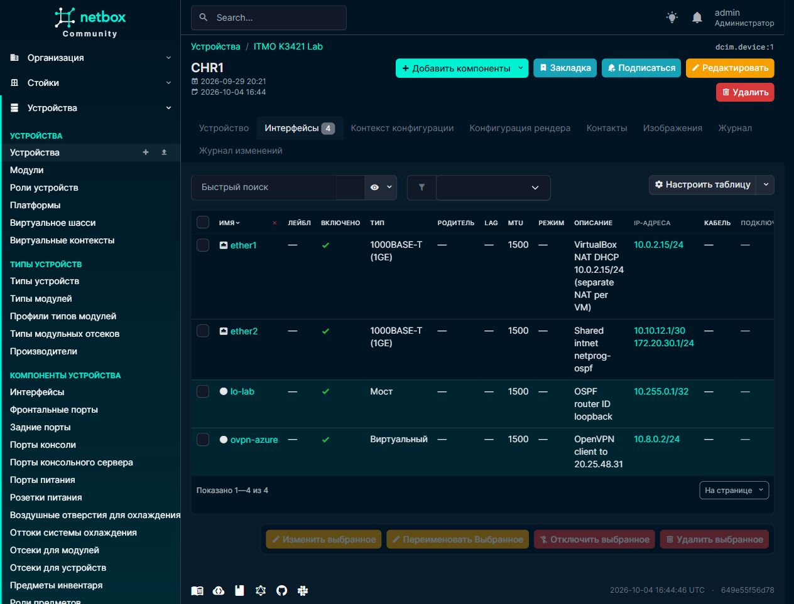

Рисунок 3 — Интерфейсы и IP-адреса CHR1 в NetBox.

### 3. Выгрузка данных из NetBox

Подготовлена роль Ansible `netbox_export`. Через API NetBox она получает устройства, интерфейсы, адреса, префиксы и связанные справочники, затем сохраняет данные в JSON. Адрес NetBox и токен доступа передаются через отдельный файл переменных.

На Ubuntu выполнена выгрузка в тестовом режиме:

```bash
cd /home/labuser/lab3
ansible-playbook export.yml --check -e @/home/labuser/.private/lab3-secrets.json
```

Роль выполняет запросы на чтение. Сохранение локального файла разрешено параметром `check_mode: false`, поэтому JSON создаётся и при запуске с `--check`. Данные в NetBox при этом не изменяются.

Выгрузка завершилась без ошибок. Получен файл `evidence/netbox-export.json`.

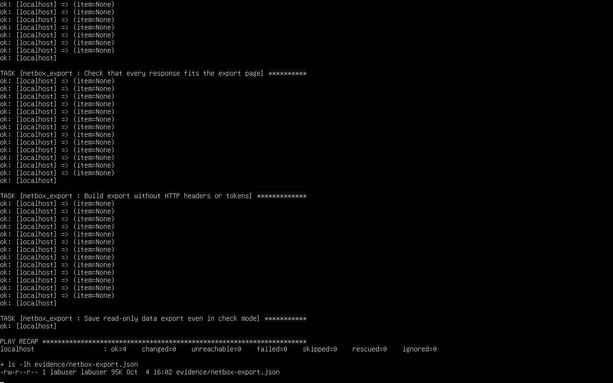

Рисунок 4 — Выгрузка данных NetBox в тестовом режиме.

### 4. Настройка CHR по данным NetBox

Подготовлен сценарий `configure-from-netbox.yml`. Он получает из NetBox имена устройств и IP-адреса, формирует список подключений и применяет настройки к двум маршрутизаторам через модуль `community.routeros.command`.

Имя берётся из поля `name` карточки устройства. Для его установки используется команда:

```routeros
/system identity set name="{{ desired_name }}"
```

Для назначения адреса используется команда:

```routeros
/ip address add address="{{ item.address }}" interface="{{ item.assigned_object.name }}"
```

Перед выполнением проверяются текущее имя и наличие адреса, чтобы повторный запуск не создавал дубликаты. На Ubuntu выполнен запуск:

```bash
ansible-playbook configure-from-netbox.yml -e @/home/labuser/.private/lab3-secrets.json
```

Проверка обоих устройств завершилась с `failed=0` и `unreachable=0`.

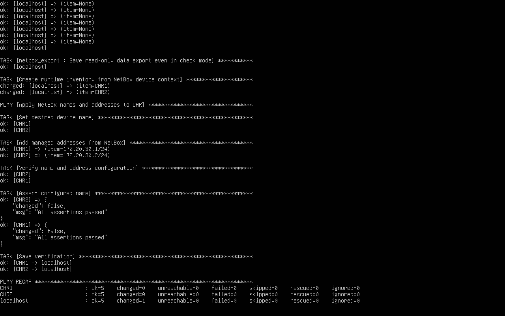

Рисунок 5 — Настройка CHR1 и CHR2 по данным NetBox.

На каждом маршрутизаторе проверены имя и адрес новой подсети:

```routeros
:put [/system identity get name]
/ip address print where network=172.20.30.0
```

На CHR1 подтверждены имя `CHR1` и адрес `172.20.30.1/24` на `ether2`.

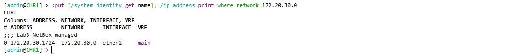

Рисунок 6 — Проверка имени и IP-адреса CHR1.

На CHR2 подтверждены имя `CHR2` и адрес `172.20.30.2/24` на `ether2`.

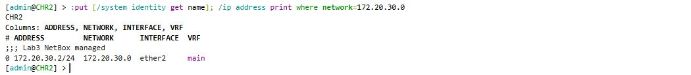

Рисунок 7 — Проверка имени и IP-адреса CHR2.

### 5. Сбор идентификаторов и запись в NetBox

Подготовлен сценарий `collect-serials.yml`. У виртуального CHR нет аппаратного серийного номера RouterBOARD, поэтому в поле «Серийный номер» записывается его виртуальный идентификатор `system-id`. Источник значения отмечен в дополнительном поле `serial_source`.

Для чтения идентификатора сценарий выполняет на каждом маршрутизаторе команду:

```routeros
:put [/system license get system-id]
```

Полученное значение передаётся в поле `serial` соответствующей карточки NetBox через PATCH-запрос. На Ubuntu выполнен запуск:

```bash
ansible-playbook collect-serials.yml -e @/home/labuser/.private/lab3-secrets.json
```

Сценарий завершился без ошибок на обоих устройствах.

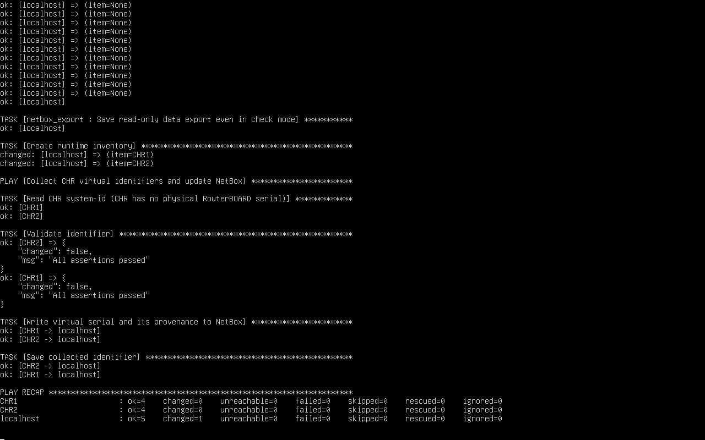

Рисунок 8 — Сбор идентификаторов и запись в NetBox.

В карточке CHR1 сохранён идентификатор `NyZSvhIIDhA`.


Рисунок 9 — Идентификатор CHR1 в NetBox.

В карточке CHR2 сохранён идентификатор `wIm+sa2iVrA`.

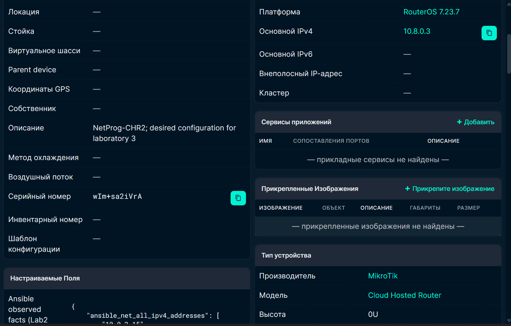

Рисунок 10 — Идентификатор CHR2 в NetBox.

После записи идентификаторов выгрузка NetBox выполнена повторно. Итоговый JSON содержит оба значения.

### 6. Проверка локальной связи

#### 6.1. Проверка с CHR1 до Ubuntu

В терминале CHR1 выполнена команда:

```routeros
/ping 172.20.30.10 count=4
```

От Ubuntu с NetBox получены четыре ответа без потерь.

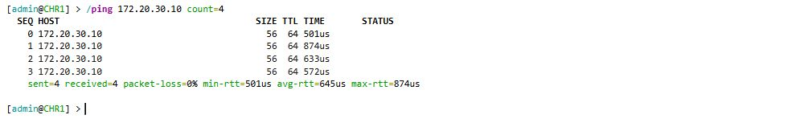

Рисунок 11 — Проверка связи с CHR1 до Ubuntu.

#### 6.2. Проверка с CHR2 до Ubuntu

Та же проверка выполнена с CHR2:

```routeros
/ping 172.20.30.10 count=4
```

Получены четыре ответа без потерь.

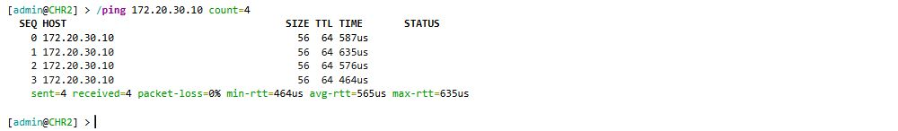

Рисунок 12 — Проверка связи с CHR2 до Ubuntu.

## Приложенные файлы

- [netbox-export.json](netbox-export.json): выгрузка данных NetBox.
- [configure-from-netbox.yml](configure-from-netbox.yml): сценарий настройки имён и IP-адресов.
- [collect-serials.yml](collect-serials.yml): сценарий сбора идентификаторов и записи в NetBox.
- [topology.drawio](topology.drawio): исходный файл схемы сети.

## Вывод

На отдельной виртуальной машине развёрнут NetBox и заполнены сведения о двух CHR. С помощью Ansible данные выгружены в JSON, применены имена и IP-адреса из системы учёта, собраны и сохранены идентификаторы устройств. Связь обоих маршрутизаторов с Ubuntu проверена без потерь.
