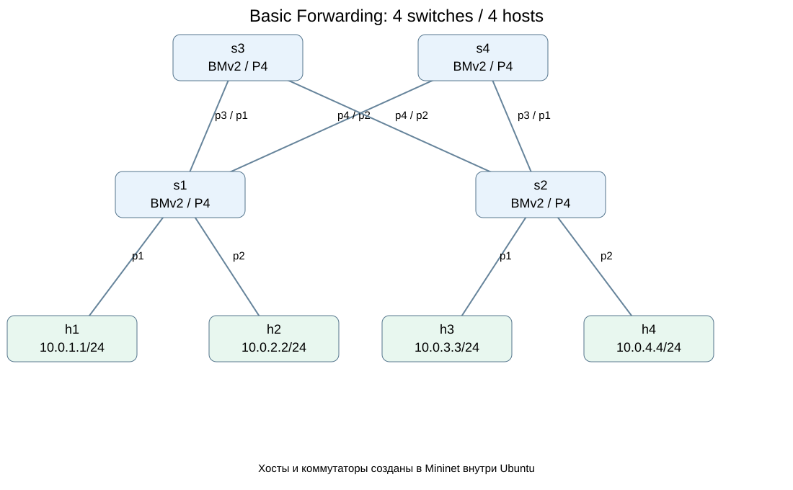
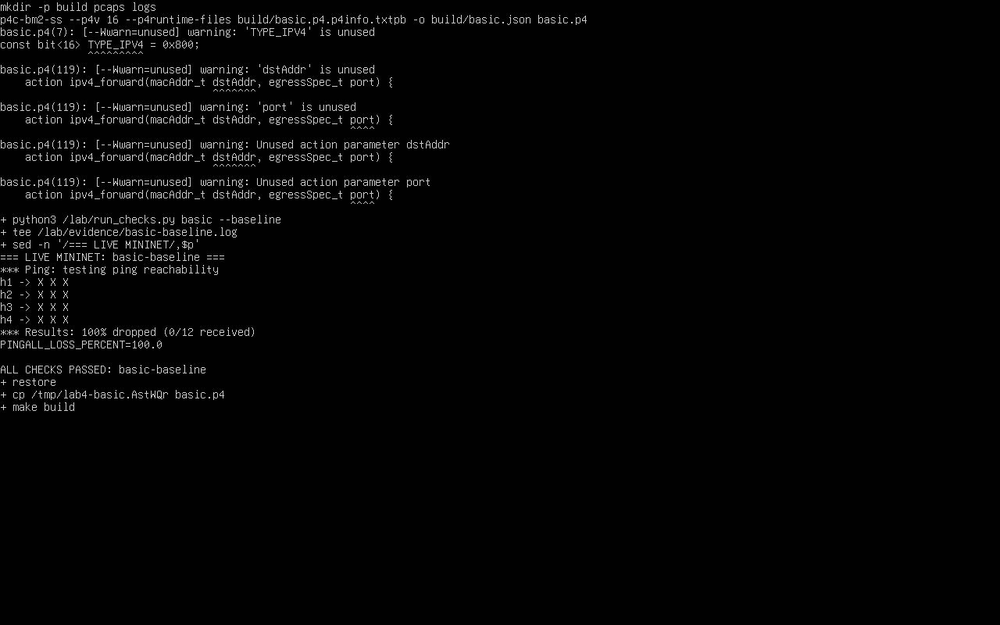
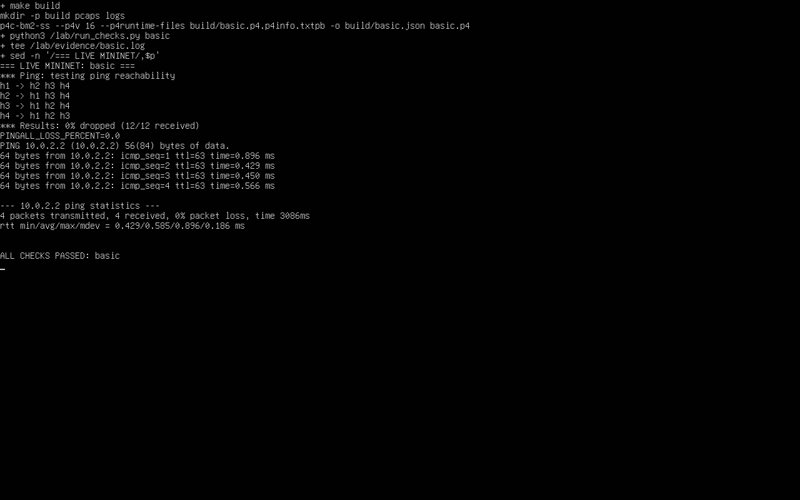
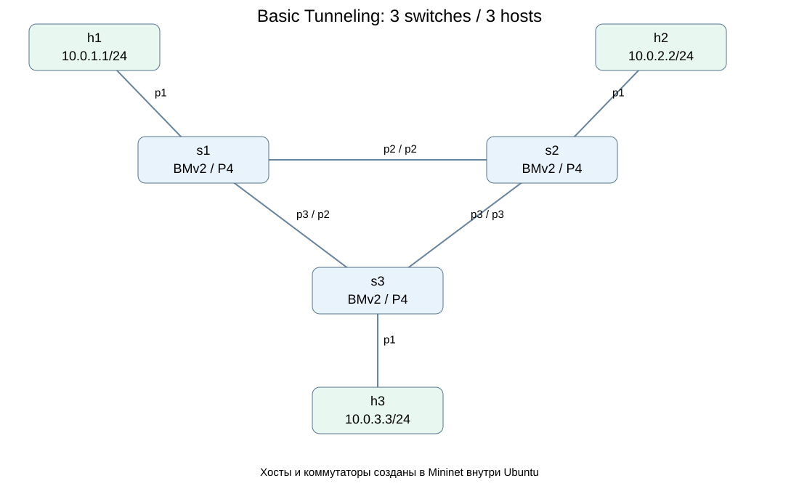
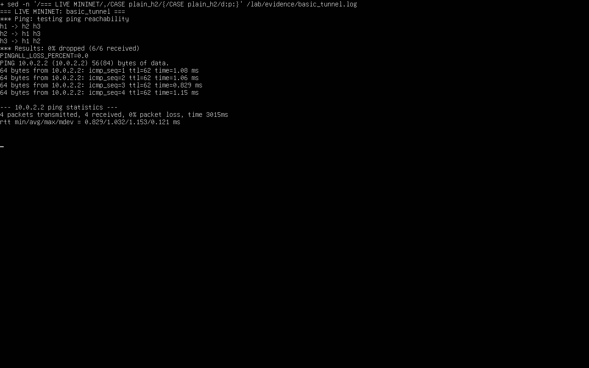
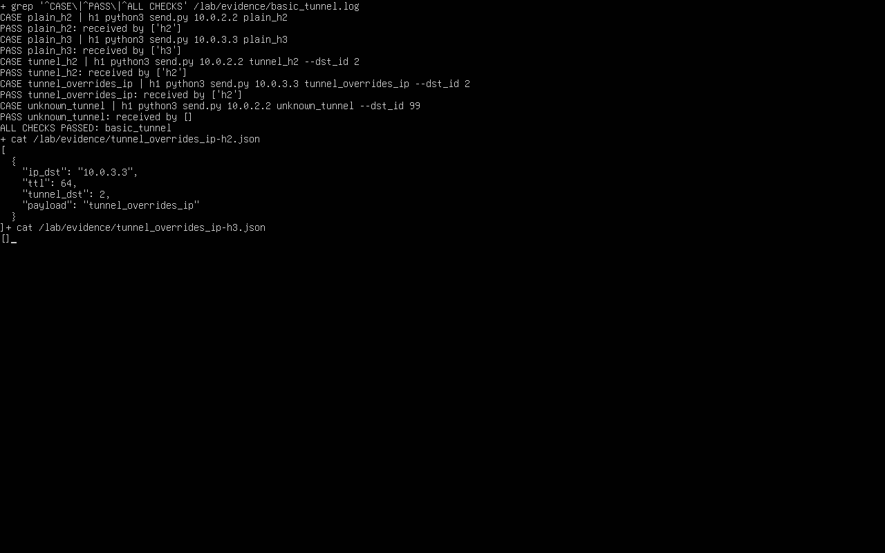

University: [ITMO University](https://itmo.ru/ru/)  
Faculty: [FICT](https://fict.itmo.ru)  
Course: [Network programming](https://github.com/itmo-ict-faculty/network-programming)  
Year: 2025/2026  
Group: К3421  
Author: Царёв Александр Сергеевич  
Lab: Lab4  
Date of create: 29.09.2026  
Date of finished: 
# Лабораторная работа №4
# Базовая пересылка и туннелирование на языке P4

## Цель работы

Изучить обработку пакетов на языке P4. Реализовать пересылку IPv4-пакетов и передачу пакетов по идентификатору туннеля в упражнениях Basic Forwarding и Basic Tunneling.

## Ход работы

### 1. Подготовка среды

Для выполнения работы использована локальная виртуальная машина Ubuntu 24.04 в VirtualBox. Инструменты P4, программные коммутаторы BMv2 и Mininet размещены в контейнере Docker. Вместо создания машины через Vagrant использована ранее подготовленная Ubuntu.

Загружен репозиторий упражнений:

```bash
git clone https://github.com/p4lang/tutorials.git p4-tutorials
```

По приложенному Dockerfile подготовлен контейнер `netprog-p4-lab4`. Каталог упражнений доступен внутри контейнера по пути `/tutorials`, каталог со сценарием проверки по пути `/lab`. Mininet создаёт хосты, коммутаторы и соединения для каждого упражнения.

### 2. Проверка исходного шаблона Basic Forwarding

Использована топология из четырёх коммутаторов и четырёх хостов:



Рисунок 1 — Топология Basic Forwarding.

До изменения программы проверена связность хостов. В каталоге упражнения исходный шаблон скомпилирован, затем запущен сценарий проверки:

```bash
cd /tutorials/exercises/basic
make build
python3 /lab/run_checks.py basic --baseline
```

Сценарий создаёт сеть Mininet и выполняет `pingAll`. В исходном шаблоне обработка IPv4 не реализована, поэтому ответы не получены: потеряно 12 из 12 пакетов. Сообщение `ALL CHECKS PASSED: basic-baseline` означает, что подтверждено ожидаемое отсутствие связности исходного шаблона.



Рисунок 2 — Проверка связности до изменения программы.

### 3. Реализация IPv4-пересылки

В файле `basic.p4` добавлен разбор заголовков Ethernet и IPv4. Для Ethernet с типом `0x0800` выполняется переход к разбору IPv4.

В действие `ipv4_forward` добавлены выбор выходного порта, изменение MAC-адресов и уменьшение TTL:

```p4
action ipv4_forward(macAddr_t dstAddr, egressSpec_t port) {
    standard_metadata.egress_spec = port;
    hdr.ethernet.srcAddr = hdr.ethernet.dstAddr;
    hdr.ethernet.dstAddr = dstAddr;
    hdr.ipv4.ttl = hdr.ipv4.ttl - 1;
}
```

Таблица `ipv4_lpm` выбирает маршрут по адресу назначения IPv4 с поиском наиболее длинного совпадающего префикса. При отсутствии маршрута пакет отбрасывается. Таблица применяется к IPv4-пакетам с TTL больше единицы:

```p4
apply {
    if (hdr.ipv4.isValid() && hdr.ipv4.ttl > 1) {
        ipv4_lpm.apply();
    } else {
        drop();
    }
}
```

После обработки пересчитывается контрольная сумма IPv4. В выходной пакет записываются заголовки Ethernet и IPv4.

Исправленная программа скомпилирована и проверена:

```bash
make build
python3 /lab/run_checks.py basic
```

Получены ответы во всех 12 направлениях между хостами. Дополнительно с `h1` выполнена команда `ping -c 4 10.0.2.2`: получены четыре ответа без потерь.



Рисунок 3 — Проверка IPv4-пересылки.

### 4. Реализация туннелирования

Для Basic Tunneling использована топология из трёх коммутаторов и трёх хостов:



Рисунок 4 — Топология Basic Tunneling.

В файле `basic_tunnel.p4` реализован разбор дополнительного заголовка `myTunnel`:

```p4
header myTunnel_t {
    bit<16> proto_id;
    bit<16> dst_id;
}
```

Поле `proto_id` определяет протокол внутри туннеля, поле `dst_id` задаёт идентификатор получателя. Заголовок туннеля разбирается при типе Ethernet `0x1212`. Если `proto_id` равен `0x0800`, далее разбирается IPv4.

Для выбора порта по точному совпадению `dst_id` используется таблица `myTunnel_exact`. При отсутствии записи пакет отбрасывается. Проверка туннельного заголовка выполняется первой:

```p4
apply {
    if (hdr.myTunnel.isValid()) {
        myTunnel_exact.apply();
    } else if (hdr.ipv4.isValid() && hdr.ipv4.ttl > 1) {
        ipv4_lpm.apply();
    } else {
        drop();
    }
}
```

Таким образом, для туннельного пакета порт выбирается по `dst_id`. Для обычного IPv4-пакета используется адрес назначения. При сборке выходного пакета заголовки записываются в порядке Ethernet, `myTunnel`, IPv4.

### 5. Проверка связности Basic Tunneling

В каталоге второго упражнения выполнены команды:

```bash
cd /tutorials/exercises/basic_tunnel
make build
python3 /lab/run_checks.py basic_tunnel
```

Обычные IPv4-пакеты проходят во всех шести направлениях между тремя хостами. Дополнительная проверка с `h1` до `10.0.2.2` также завершилась без потерь. На снимке показан соответствующий фрагмент журнала выполненной проверки в консоли Ubuntu.



Рисунок 5 — Проверка связности Basic Tunneling.

### 6. Проверка выбора получателя по dst_id

С хоста `h1` последовательно отправлены обычные и туннельные пакеты. На `h2` и `h3` выполнялся захват пакетов. Сценарий сравнивал фактического получателя с ожидаемым.

Для обычных пакетов использованы команды:

```bash
python3 send.py 10.0.2.2 plain_h2
python3 send.py 10.0.3.3 plain_h3
```

Первый пакет принят на `h2`, второй на `h3`.

Затем отправлены пакеты с заголовком туннеля:

```bash
python3 send.py 10.0.2.2 tunnel_h2 --dst_id 2
python3 send.py 10.0.3.3 tunnel_overrides_ip --dst_id 2
python3 send.py 10.0.2.2 unknown_tunnel --dst_id 99
```

Оба пакета с `dst_id=2` приняты на `h2`, в том числе пакет с внутренним IP-адресом `10.0.3.3`. Пакет с неизвестным `dst_id=99` не принят ни на `h2`, ни на `h3`.

На снимке приведены команды отправки и результаты всех пяти проверок из журнала запуска. Ниже показаны данные захвата для случая `tunnel_overrides_ip`: на `h2` получен пакет с `ip_dst=10.0.3.3` и `tunnel_dst=2`, список пакетов на `h3` пуст.



Рисунок 6 — Проверка выбора получателя туннельного пакета.

## Вывод

Реализованы IPv4-пересылка и туннелирование на языке P4. Проверена связность хостов в обеих топологиях. Подтверждено, что при наличии туннельного заголовка получатель определяется по `dst_id`, а пакет с неизвестным идентификатором отбрасывается.

## Приложенные файлы

- [basic.p4](basic.p4): программа IPv4-пересылки.
- [basic_tunnel.p4](basic_tunnel.p4): программа туннелирования.
- [topologies.drawio](topologies.drawio): схемы обеих топологий.

Скриншоты результатов включены в отчёт. В архив также включены вспомогательные файлы для повторного запуска: сценарии проверки, описание среды и настройки топологий.